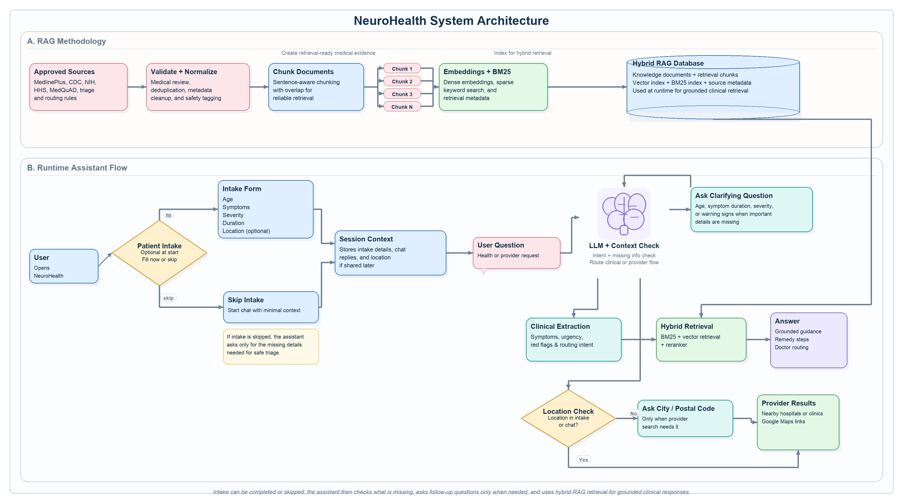
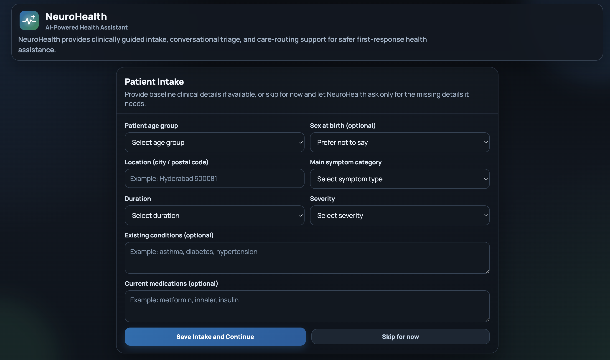
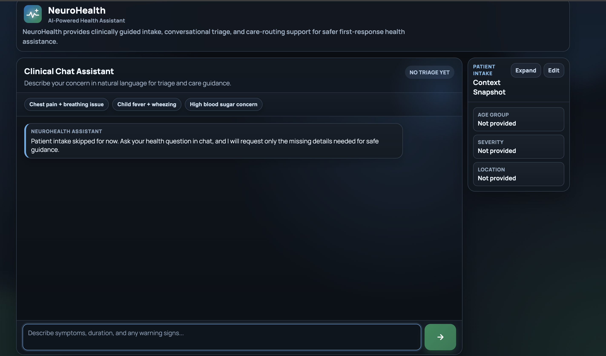

# NeuroHealth

NeuroHealth is an AI-powered health assistant project focused on symptom understanding, urgency triage, care navigation, and safe conversational guidance.

## System Architecture

The architecture combines a hybrid RAG pipeline, clinical triage logic, conversational LLM reasoning, and location-aware provider search in one end-to-end workflow.



## Frontend Preview

### Patient Intake

The patient intake screen collects core details such as age group, symptom category, severity, duration, and optional location before the user starts chatting.



### Clinical Chat Assistant

The chat interface uses the saved intake context, supports follow-up questions, and can return grounded care guidance together with nearby-provider suggestions when needed.



## Repository Layout

- `src/neurohealth/phase1/` - Phase 1 data foundation pipeline
- `configs/` - Source registry, seeds, triage rules, and routing definitions
- `data/` - Raw snapshots and processed intermediate artifacts
- `docs/images/` - README architecture and frontend preview images
- `scripts/` - Pipeline runners and backend entrypoints
- `tests/` - Validation and regression tests
- `requirements/` - Environment-specific dependency files

## Key Commands

Install Phase 1 dependencies:

```bash
python3 -m pip install -r requirements/phase1.txt
```

Install backend dependencies:

```bash
python3 -m pip install -r requirements/backend.txt
```

Run the Phase 1 pipeline:

```bash
python3 scripts/run_phase1_pipeline.py --project-root "$(pwd)"
```

Run the backend API:

```bash
python3 scripts/run_backend.py
```

Optional backend configuration can be provided through environment variables or a local `.env` file in the project root. A reference file is available at `.env.example`.

Or with uvicorn directly:

```bash
python3 -m uvicorn neurohealth.backend.app:app --app-dir src --reload --port 8000
```

Backend docs will be available at:

```text
http://127.0.0.1:8000/docs
```

Core backend endpoints:

- `GET /health`
- `GET /config`
- `GET /triage/rules`
- `GET /routing/rules`
- `POST /sessions`
- `GET /sessions/{session_id}`
- `PATCH /sessions/{session_id}/intake`
- `POST /sessions/{session_id}/messages`
- `POST /providers/nearby`
- `POST /knowledge/search`
- `POST /feedback`

Live nearby-provider lookup:

- When the user asks for nearby hospitals or clinics, NeuroHealth first checks the saved intake location.
- If location is available, the backend tries a live OpenStreetMap-based search (Nominatim geocoding + Overpass nearby lookup).
- If live lookup is unavailable, the system falls back to the local template provider suggestions so the chat flow still works.
